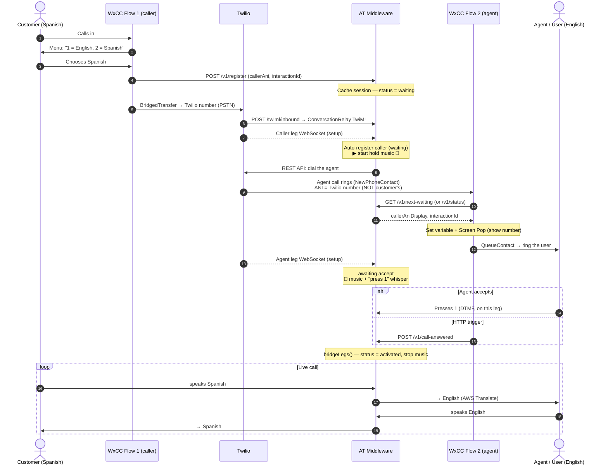
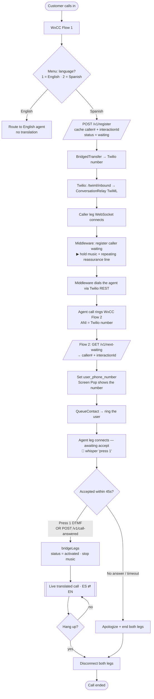

# Solution Brief — Webex ↔ Twilio Human-to-Human Translation

A self-contained summary of the architecture, the core problem, the options, what's
built, and the open questions. Written to be ingested as standalone context (no code
required to understand it).

---

## 1. What this is

A live **human-to-human voice translation** system. A Spanish-speaking customer and
an English-speaking agent talk on a phone call; a middleware translates speech in
both directions in real time.

- **Telephony / translation transport:** Twilio **ConversationRelay** (speech-to-text,
  translate, text-to-speech over a WebSocket).
- **Contact center:** **Webex Contact Center (WxCC)** with two Flow Designer flows.
- **Middleware ("AT middleware"):** our server. Bridges the two call legs, runs the
  translation, and holds per-call session state. (A local Node.js test version exists;
  production is AWS Lambda + DynamoDB.)
- **Translation engine:** AWS Translate (Spanish ⇄ English).

---

## 2. The call flow (high level)

1. Customer calls in → **WxCC Flow 1** (caller side).
2. Flow 1 plays a menu: **"1 = English, 2 = Spanish."**
3. **Spanish** → Flow 1 `BridgedTransfer`s the call to a **Twilio number**.
4. Twilio answers via ConversationRelay → the **caller leg** connects to the middleware.
5. The middleware **dials the agent** (a second Twilio call) → rings into **WxCC Flow 2**
   (agent side) → **QueueContact** → a human agent/user.
6. While waiting, the caller hears **hold music + a repeating reassurance line**.
7. The agent **accepts** (presses **1**, or an HTTP signal) → the middleware **bridges**
   the two legs → translation begins.
8. If no one answers in 45s → apologize + hang up.

### Sequence diagram

### Flowchart

---

## 3. THE core problem — correlation

**Flow 1 knows the customer's phone number. Flow 2 does not.**

When the middleware dials the agent, **Twilio blocks using the customer's number as
caller ID** (error **21210** — "you may only call from numbers you've verified or
purchased"). So Flow 2's incoming call shows the **Twilio number**, identical for every
call. With many concurrent calls, Flow 2 cannot tell which customer is which.

Also confirmed by testing: the call reaches Twilio over **PSTN** (not SIP) — the inbound
payload had **empty SIP headers** (`sipHeaders: {}`) and a `ForwardedFrom`. **PSTN strips
all custom metadata**, so a custom header (e.g. `X-Customer-Number`) does **not** survive.

Consequences observed:
- Two simultaneous calls show the **same number** in the Webex queue → can't be
  distinguished or picked up separately.
- "Activating the right session" needs a reliable per-call key.

---

## 4. The options (to carry the customer's number / a key to Flow 2)

| # | Approach | Works on PSTN? | Reliability | Notes |
|---|----------|----------------|-------------|-------|
| **1** | **SIP / UUI header** | needs SIP, not PSTN | ✅ best | Webex sends the call as SIP to a Twilio SIP Domain with a custom `X-Correlation-Id`/UUI header. Preserves caller ID + unique key per call. Removes number pools and guessing entirely. **The clean long-term fix.** |
| **2** | **Data-bridge (out-of-band cache)** | ✅ yes | ✅ if Flow 2 has a key | **This is what we built.** Middleware caches `{callerAni, interactionId}` keyed by phone number; Flow 2 fetches it via HTTP. *But* it assumes Flow 2 can pass the caller's number as the lookup key — which it can't over PSTN unless combined with #3. |
| **3** | **DTMF / SendDigits** | ✅ yes | ✅ correct at scale | Middleware "beeps" the customer's number into the agent call as touch-tones; a **Collect Digits** node in Flow 2 captures it → Flow 2 then has the real per-call key. Reliable at any scale; needs a timing test. |
| **4** | **Number pool (DID pool)** | ✅ yes | ✅ correct at scale | Dial each concurrent agent call from a **different** Twilio number → Webex sees distinct callers → distinguishable + a unique key. Costs N numbers; caps concurrency. |
| **5** | **FIFO `next-waiting`** | ✅ yes | 🟡 best-effort | Hand out the **oldest waiting** caller. Fine for low/serial volume; **mis-pairs** under many simultaneous parallel pickups. A testing stopgap. |
| **6** | **Press 1 (DTMF accept)** | ✅ yes | ✅ for *accepting* | The keypress arrives on that call's own connection (already linked to its caller) → self-correlating. Solves *activation* at any scale, but does **not** by itself show the number on the agent screen. |

**Recommended path:** On PSTN today, combine **#2 (data-bridge, built) + #3 (SendDigits)**
so Flow 2 gets the real number per call. Pursue **#1 (SIP)** in parallel as the clean
end state. Use **#6 (Press 1)** for accepting (already works, scale-safe).

---

## 5. What's built (middleware)

- **Hold music** while waiting: looping track + a reassurance line that repeats
  (`music → line → ~7s pause → resume music`, until accept or 45s timeout). Uses
  ConversationRelay's `play` message; note `loop:0` = up to 1000 plays, and a resumed
  `play` must be sent *after* the spoken line (not back-to-back) or it's dropped.
- **Agent accept gate** (`AGENT_ACCEPT_DTMF`): with an ACD/queue (Webex) that
  auto-answers, the middleware does **not** bridge on "answered." It waits for the agent
  to **press 1** (or an HTTP signal), repeating a whisper ("press 1 to connect") that
  also **announces the caller's number** (digit-by-digit). Verified live: Webex passes
  the keypress through.
- **Session registry** (in-memory locally; DynamoDB in prod): keyed by **normalized
  phone number**. `status: waiting → activated`. Auto-expires (TTL). A `register` for a
  number whose prior entry is finished **resets it to `waiting`** (so the same number
  calling again works).
- **Caller number formatting:** responses include `callerAni`, `callerAniE164`
  (`+16195764744`), and `callerAniDisplay` (`(619) 576-4744`).

---

## 6. HTTP endpoint reference

| Endpoint | Method | Purpose |
|----------|--------|---------|
| `/twiml/inbound` | POST | Twilio voice webhook → ConversationRelay TwiML |
| `/ws` | WS | ConversationRelay WebSocket (caller & agent legs) |
| `/v1/register` | GET/POST | Cache a session `{callerAni, id}` → status `waiting`. (Flow 1 calls this before the transfer; the caller also auto-registers on connect.) |
| `/v1/status` | GET | Returns `activated: true/false` + the cached entry for a `callerAni` |
| `/v1/next-waiting` | GET | FIFO: oldest waiting caller; `?claim=true` advances to the next |
| `/v1/call-answered` | GET/POST | Activate/bridge a call — by `callerAni`, or the single waiting one if none given (409 if several) |
| `/sessions` | GET | Debug: live connections + registry |
| `/last-inbound` | GET | Last few inbound webhook payloads (for correlation research) |

Params accepted as query string or POST body (form or JSON): `callerAni` /
`phoneNumber` / `from`, and `id` / `interactionId`.

---

## 7. Key facts & constraints (learned/verified)

- **Twilio blocks arbitrary caller ID** on outbound calls (error 21210) — can't show the
  customer's number as caller ID over PSTN.
- **PSTN strips custom SIP headers / UUI.** Only SIP (into a Twilio SIP Domain) preserves
  them (`SipHeader_X-*`). BYOC trunks discard headers; Elastic SIP Trunking has no
  webhook layer.
- **ConversationRelay** server→Twilio messages include `text`, `play` (audio),
  `sendDigits` (emit DTMF), `language`, `end`. Inbound `dtmf` = `{ "type":"dtmf",
  "digit":"1" }`. Enable detection with `dtmfDetection: "true"`.
- **The accept signal must identify the session.** In-band (DTMF on the leg) is
  self-correlating; out-of-band (HTTP) needs a key, which Flow 2 lacks over PSTN.
- **Display the number on the agent's screen** via a flow variable + **Screen Pop**
  (set "Inside Desktop", not New Tab) or an **Agent-viewable variable** — this works on
  PSTN. Only the caller-ID *line* needs SIP.
- **Webex "Functions"** (Python/JSON) can format/manipulate the number for display, but
  can't *source* it — the flow must fetch it first.

---

## 8. Open questions for the Webex team

1. **Can Webex egress the call as SIP** to an external SIP Domain (Twilio's
   `*.sip.twilio.com`), not a PSTN number?
2. If yes, can the flow **stamp a custom `X-Correlation-Id` header** (or UUI) per call?
3. **Can the agent-side flow (Flow 2) read the original caller's ANI** at all today?
   (Currently it sees the Twilio number.)
4. Does `AgentAnswer` fire its HTTP request **only on a human accept**, not on queue
   auto-answer?
5. With the **new SIP Header support** in Flow Designer, can Flow 2 read the customer's
   number / `X-Customer-Number`?

A **yes** to #1–#2 makes SIP viable and removes the number-pool / DTMF / FIFO
workarounds entirely.

---

## 9. One-paragraph summary

A Spanish customer picks "Spanish" in a Webex menu; the call is bridged through Twilio
ConversationRelay to a middleware that translates speech both ways and connects an
English agent. The hard part is **correlation**: over PSTN, Twilio won't pass the
customer's number to the agent side, so the agent's Webex flow can't tell concurrent
calls apart. The middleware solves *activation* reliably with a **DTMF "press 1"** accept
(self-correlating) and carries the customer's number across via an **out-of-band cache**
(`/v1/register` → `/v1/next-waiting`/`/v1/status`). For correctness at scale on PSTN, the
number must reach Flow 2 as a unique key — via **SendDigits (DTMF)** or a **number pool**
— and the clean long-term fix is **SIP** with a custom correlation header.
