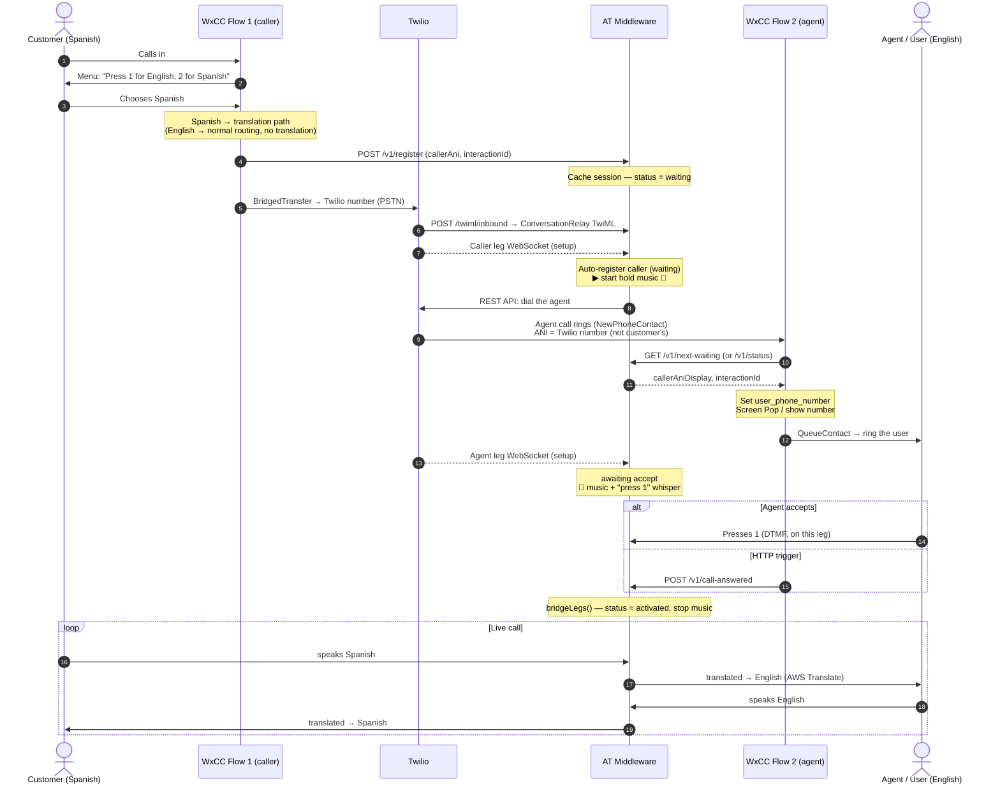
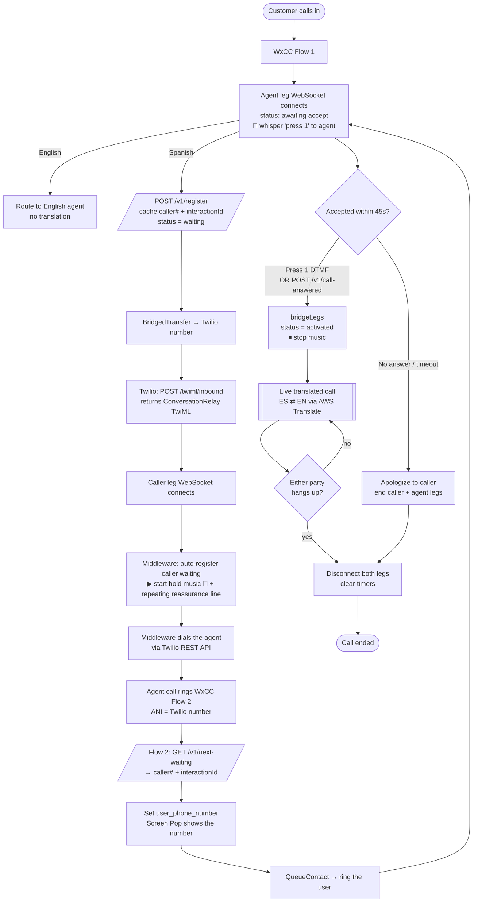
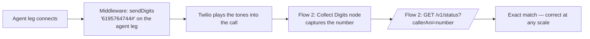
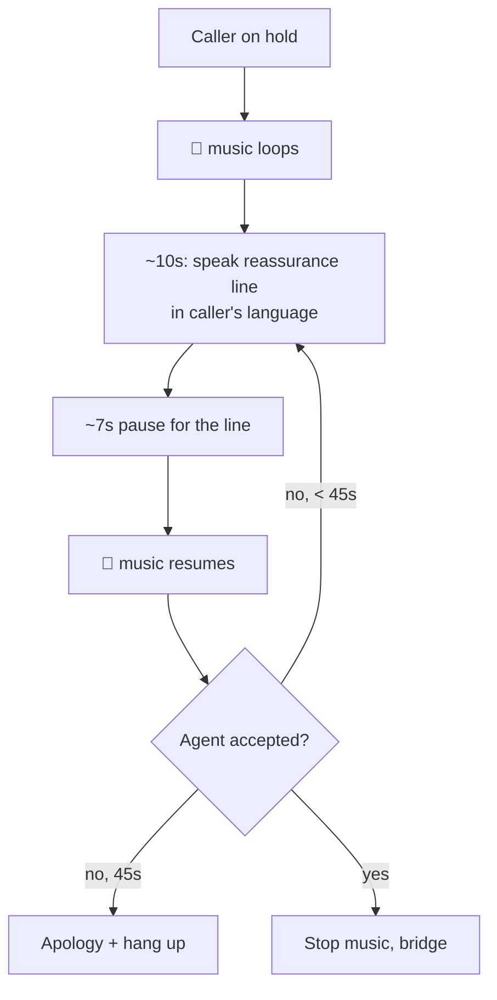

# Translation Call Flow — Architecture & Diagrams

How a Spanish↔English translated call moves through Webex Contact Center, Twilio,
and the AT middleware (this `local-server`). Reflects what's built as of the
`testing-branch` work.

## Participants

| Name | What it is |
|------|-----------|
| **Customer** | The inbound caller (e.g. Spanish speaker) |
| **WxCC Flow 1** | Webex flow on the **caller** side (`NewContact → Menu → BridgedTransfer`) |
| **Twilio** | Carries the call; runs ConversationRelay (the translation transport) |
| **AT Middleware** | Our server — bridges the two legs, runs translation, holds session state |
| **WxCC Flow 2** | Webex flow on the **agent** side (`NewPhoneContact → QueueContact`) |
| **Agent / User** | The person who takes the call (English speaker) |

---

## Sequence diagram (timeline)



---

## Flowchart (branches & decisions)



---

## Option 3 (future) — beep the number in via DTMF

To give Flow 2 the **real per-call key** over PSTN (no FIFO guessing), the
middleware can send the caller's number as DTMF tones on the agent leg, and
Flow 2 collects them:



---

## The hold experience (while waiting for the agent)



---

## Why the `register` / `next-waiting` dance exists

The core constraint: **Flow 1 knows the customer's number; Flow 2 does not.**
When the middleware dials the agent, Twilio blocks using the customer's number as
caller ID (error 21210), so Flow 2 only sees the **Twilio number** — identical for
every call. The registry carries the number across the gap:

- **Reliable at any scale:** `Press 1` (DTMF) — the keypress arrives on that call's
  own connection, already linked to its caller. Self-correlating.
- **Best-effort (low volume):** `GET /v1/next-waiting` — hands out the oldest
  waiting caller (FIFO). Can mis-pair under many simultaneous parallel pickups.
- **The clean long-term fix:** SIP/UUI (a unique correlation header per call) — see
  `webex-correlation-key-research.md`.

---

## Endpoint reference

| Endpoint | Method | Purpose |
|----------|--------|---------|
| `/twiml/inbound` | POST | Twilio voice webhook → ConversationRelay TwiML |
| `/ws` | WS | ConversationRelay WebSocket (caller & agent legs) |
| `/v1/register` | GET/POST | Cache a session `{callerAni, id}` — status `waiting` |
| `/v1/status` | GET | Is this call `activated`? Returns the cached entry |
| `/v1/next-waiting` | GET | FIFO: oldest waiting caller (`?claim=true` to advance) |
| `/v1/call-answered` | GET/POST | Activate/bridge a call (by `callerAni`, or the single waiting one) |
| `/sessions` | GET | Debug view: live connections + registry |
| `/last-inbound` | GET | Last few inbound webhook payloads (correlation research) |

Responses include `callerAni`, `callerAniE164` (`+16195764744`) and
`callerAniDisplay` (`(619) 576-4744`).
```
